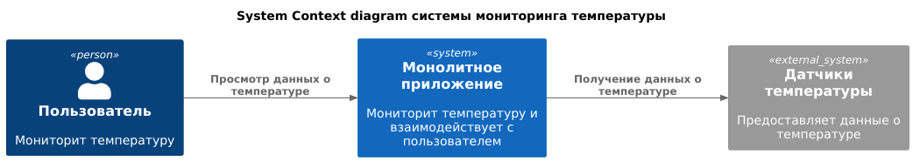

# 3 спринт

## Задание 1: Анализ и проектирование
### Подзадание 1.1: Анализ и планирование

#### Описание функциональности текущего монолитного приложения.
- Мониторинг температуры:
  - Получение данных о температуре с датчиков, установленных в домах пользователей.
  - Возможность просмотра текущей температуры через веб-интерфейс.

#### Анализ архитектуры монолитного приложения (язык программирования, база данных, архитектура, взаимодействие, масштабируемость, развертывание).
- Язык программирования: Приложение написано на Java.
- База данных: Используется реляционная база данных PostgreSQL.
- Архитектура: Монолитное приложение, в котором все компоненты (бизнес-логика, обработка запросов, взаимодействие с базой данных) находятся в одном коде.
- Взаимодействие: Синхронное, то есть запросы обрабатываются последовательно, и каждое действие требует ответа для продолжения.
- Масштабируемость: Ограничена, так как монолитные приложения сложно масштабировать по частям. В случае увеличения нагрузки требуется масштабировать весь монолит целиком.
- Развертывание: Требует остановки всего приложения при внесении изменений или обновления.

#### Домены и границы контекстов в системе.

1. Управление устройствами (Device Management)
   - Контекст "Регистрация и управление устройствами":
     - Отвечает за добавление, удаление и настройку умных устройств пользователем.
     - Границы: Регистрация новых устройств, изменение их состояния, обновление конфигураций.
2. Настройка автоматизированных сценариев (Automation)
   - Контекст "Создание и управление сценариями": 
     - Позволяет пользователям создавать сценарии для автоматического управления устройствами на основе условий.
     - Границы: Создание, редактирование, удаление и исполнение сценариев.
3. Управление пользователями и домами (User and Home Management)
   - Контекст "Управление пользователями":
     - Управление учётными записями пользователей и их правами доступа.
     - Границы: Регистрация пользователей, управление ролями и правами.
   - Контекст "Управление домами": 
     - Управление объектами недвижимости и доступом к ним.
     - Границы: Добавление домов, управление правами доступа к устройствам для каждого дома.
4. Мониторинг и телеметрия (Monitoring and Telemetry)
   - Контекст "Сбор и хранение телеметрии":
     - Отвечает за сбор данных с устройств и их хранение для последующего анализа.
     - Границы: Сбор данных в реальном времени, хранение телеметрии.
   - Контекст "Отображение телеметрии":
     - Отображает данные пользователям в удобной форме (графики, отчёты).
     - Границы: Визуализация данных, предоставление исторических данных.
   - Контекст "Мониторинг состояния оборудования":
     - Обеспечивает мониторинг состояния устройств и отправку уведомлений при возникновении проблем.
     - Границы: Автоматическое выявление проблем с устройствами, уведомления о сбоях.
5. Управление подписками и биллингом (Subscription and Billing)
   - Контекст "Управление подписками":
     - Управление подписками пользователей и их доступом к платным функциям.
     - Границы: Подписки, изменение тарифных планов.
   - Контекст "Обработка платежей":
     - Обрабатывает платежи и управляет платёжной информацией.
     - Границы: Оплата подписок, история оплат.

#### Создана C4 диаграмма (System Context diagram), визуализирующая взаимодействие монолитного приложения с внешним миром.
Диаграмма создана с использованием PlantUML и соответствует стандартам C4.

Перед отправкой проверьте, что
 - [x] Описана функциональность текущего монолитного приложения.
 - [x] Проанализирована архитектура монолитного приложения (язык программирования, база данных, архитектура, взаимодействие, масштабируемость, развертывание).
 - [ ] Определены домены и границы контекстов в системе.
 - [x] Создана C4 диаграмма (System Context diagram), визуализирующая взаимодействие монолитного приложения с внешним миром.
 - [x] Диаграмма создана с использованием PlantUML и соответствует стандартам C4.

### Подзадание 1.2: Архитектура микросервисов

#### Система разбита на микросервисы в соответствии с выделенными доменами и границами контекстов.
1. **Микросервис "Управление устройствами (Device Management Service)"**
   - Контекст: Регистрация и управление устройствами
   - Функции:
     - Подключение новых устройств к системе.
     - Управление состоянием устройств (включение, выключение, настройка параметров).
     - Обновление прошивок и конфигураций.
   - Интерфейсы:
     - API для подключения и управления устройствами.
     - Взаимодействие с телеметрией для получения данных о состоянии устройств.
2. **Микросервис "Автоматизация сценариев (Automation Service)"**
   - Контекст: Создание и исполнение сценариев
   - Функции:
     - Создание и управление сценариями автоматизации.
     - Запуск сценариев на основе данных о состоянии устройств.
     - Поддержка сложных сценариев с условиями и действиями.
   - Интерфейсы:
     - API для создания сценариев пользователем.
     - Асинхронные события для исполнения сценариев в реальном времени.
3. **Микросервис "Управление пользователями и домами (User and Home Management Service)"**
   - Контексты:
     - Управление пользователями
     - Управление домами
   - Функции:
     - Регистрация новых пользователей.
     - Управление учётными записями, ролями и правами доступа.
     - Управление объектами (домами) и распределение прав на устройства внутри дома.
   - Интерфейсы:
     - API для управления пользователями и правами доступа.
     - Взаимодействие с другими микросервисами для авторизации доступа.
4. **Микросервис "Мониторинг и телеметрия (Telemetry Service)"**
   - Контексты:
     - Сбор и хранение телеметрии
     - Отображение телеметрии
     - Мониторинг состояния оборудования
   - Функции:
     - Сбор данных с устройств в реальном времени.
     - Хранение телеметрических данных для анализа и предоставления пользователю.
     - Мониторинг состояния устройств и отправка уведомлений о сбоях.
     - Визуализация данных (графики, отчёты).
   - Интерфейсы:
     - API для получения телеметрии.
     - Асинхронные события для уведомления о проблемах.
     - Взаимодействие с интерфейсами визуализации.
5. **Микросервис "Подписки и биллинг (Subscription and Billing Service)"**
   - Контексты:
     - Управление подписками
     - Обработка платежей
   - Функции:
     - Управление тарифными планами и подписками пользователей.
     - Обработка платежей за услуги и управление счетами.
     - Уведомление пользователей о сроках подписки и необходимости оплаты.
   - Интерфейсы:
     - API для управления подписками и выставления счетов.
     - Интеграция с платёжными шлюзами для обработки платежей.

#### Определено взаимодействие между микросервисами, API Gateway, базой данных и, если используется, шиной данных (например, Kafka).

#### Созданы C4 диаграммы на уровне контейнеров (Containers) и компонентов (Components), визуализирующие архитектуру системы.

#### При необходимости созданы C4 диаграммы на уровне кода (Code) для самых критичных частей системы.

#### Все диаграммы созданы с использованием PlantUML и соответствуют стандартам C4.

Перед отправкой проверьте, что
 - [ ] Система разбита на микросервисы в соответствии с выделенными доменами и границами контекстов.
 - [ ] Определено взаимодействие между микросервисами, API Gateway, базой данных и, если используется, шиной данных (например, Kafka).
 - [ ] Созданы C4 диаграммы на уровне контейнеров (Containers) и компонентов (Components), визуализирующие архитектуру системы.
 - [ ] При необходимости созданы C4 диаграммы на уровне кода (Code) для самых критичных частей системы.
 - [ ] Все диаграммы созданы с использованием PlantUML и соответствуют стандартам C4.

### Подзадание 1.3: ER-диаграмма

Перед отправкой проверьте, что
 - [ ] Определены основные сущности системы, например как «Пользователь», «Дом», «Устройство», «Тип устройства», «Модуль» и «Телеметрия».
 - [ ] Для каждой сущности определены необходимые атрибуты.
 - [ ] Описаны связи между сущностями (один-к-одному, один-ко-многим, многие-ко-многим).
 - [ ] Создана ER-диаграмма с использованием PlantUML.
 - [ ] ER-диаграмма корректно отображает все сущности, их атрибуты и связи между ними.

### Подзадание 1.4: Создание и документирование API

Перед отправкой проверьте, что
 - [ ] Выбраны типы API (REST, AsyncAPI или их комбинация) для взаимодействия между микросервисами «Управление устройствами» и «Телеметрия».
 - [ ] Спроектированы эндпойнты и методы запросов для основных операций микросервисов.
 - [ ] Описаны контракты взаимодействия для каждого эндпойнта, включая форматы запросов и ответов, коды ответа и примеры.
 - [ ] Создана интерактивная документация API с использованием Swagger/OpenAPI (для REST API) или AsyncAPI.
 - [ ] Документация API покрывает все эндпойнты и содержит исчерпывающую информацию для их использования.

## Задание 2: Разработка MVP
### Подзадание 2.1: Новые микросервисы и интеграция с монолитом

Перед отправкой проверьте, что
**Обязательные пункты:**
 - [ ] Созданы два микросервиса: «Управление телеметрией» и «Управление устройствами».
 - [ ] Микросервисы реализованы на одном из языков программирования.
 - [ ] Микросервисы работают с выбранной СУБД.
 - [ ] Реализованы все сущности и связи, определенные в ER-диаграмме.
 - [ ] Для каждого микросервиса разработано API, соответствующее спецификации OpenAPI.
 - [ ] Микросервисы развернуты в Minikube.
 - [ ] Настроено взаимодействие микросервисов с монолитом (опционально: через Kafka, или напрямую).
 - [ ] Код микросервисов добавлен в Git репозиторий.

**Дополнительные пункты:**
 - [ ] Реализован паттерн Saga для управления распределёнными транзакциями (если применимо).
 - [ ] Применён паттерн CQRS для разделения операций чтения и записи (если применимо).
 - [ ] Применены дополнительные принципы 12-факторных приложений.
 - [ ] Развернут полноценный Kafka-кластер.

### Подзадание 2.2: Подготовка 3rd party сервисов для связи микросервисов

Перед отправкой проверьте, что
**Обязательные пункты:**
 - [ ] Развернут и настроен API Gateway в Minikube.
 - [ ] Микросервисы «Управление телеметрией» и «Управление устройствами» подключены к Kafka (опционально).
 - [ ] API Gateway настроен на маршрутизацию запросов к микросервисам.
 - [ ] Протестировано взаимодействие между микросервисами и API Gateway (запросы корректно маршрутизируются и обрабатываются).

**Дополнительные пункты:**
 - [ ] Развернут и настроена Kafka в Minikube.
 - [ ] Реализована балансировка нагрузки на API Gateway.
 - [ ] Настроены механизмы безопасности на API Gateway (например, аутентификация, авторизация).
 - [ ] Проведены нагрузочные тесты для проверки работоспособности Kafka и API Gateway под нагрузкой.

## Задание 3: Автоматизация поставки (опционально)
### Подзадание 3.1: Контейнеризация микросервисов

Перед отправкой проверьте, что
- Dockerfile:
  - [ ] Создан Dockerfile для каждого микросервиса и фронтенда.
  - [ ] В Dockerfile указан базовый образ с необходимыми зависимостями.
  - [ ] Код микросервиса/фронтенда скопирован в образ.
  - [ ] Установлены специфичные зависимости.
  - [ ] Указана команда для запуска микросервиса/фронтенда.
- Helm:
  - [ ] Создан Helm chart.
  - [ ] В Helm chart файле описаны все сервисы (микросервисы, API Gateway, фронтенд).
  - [ ] Указаны связи между сервисами (порты, сети).
  - [ ] Использованы Kubernetes Deployment и Service.
- Сборка и загрузка образов:
  - [ ] Docker-образы собраны для каждого микросервиса и фронтенда.
  - [ ] Docker-образы загружены в хранилище артефактов.
- Запуск и тестирование:
  - [ ] Все сервисы успешно запускаются с помощью Helm в Minikube.
  - [ ] Сервисы взаимодействуют друг с другом без ошибок.
  - [ ] Протестирована работоспособность системы в целом.

### Подзадание 3.2: Настройка CI/CD пайплайнов

Перед отправкой проверьте, что
- Helm:
    - [ ] Созданы Helm чарты для каждого микросервиса и фронтенда.
    - [ ] В Helm чартах указаны необходимые ресурсы и зависимости для развертывания.
- CI/CD пайплайны:
    - [ ] Созданы CI/CD пайплайны для каждого микросервиса и фронтенда.
    - [ ] Пайплайны настроены на автоматический запуск при пуше кода в репозиторий.
    - [ ] Пайплайны выполняют сборку, тестирование и развертывание микросервисов/фронтенда.
    - [ ] Пайплайны интегрированы с Minicube и Helm для развертывания.
- Автоматизация:
    - [ ] Проверено автоматическое обновление микросервисов/фронтенда при изменении кода.
    - [ ] Настроено автоматическое масштабирование микросервисов.

## Как сдать работу
- Решите задания. 
- Опишите свои решения в файле Readme.md. 
- Вставьте ссылку на пул-реквест во вкладке «Ревью».
- После того как отправите ссылку, не вносите изменения в проект. 
- Сдайте проект и дождитесь комментариев ревьюера.

### На что будет смотреть ревьюер
Ревьюер не примет работу, если она не будет соответствовать требованиям:
- Репозиторий с решением публичный. 
  - Перед отправкой убедитесь, что репозиторий в вашем GitHub публичный. 
  - Иначе ревьюер не сможет проверить работу.
- В работе нет вопросов к ревьюеру по условиям задания. 
  - Если у вас возникнут вопросы по проектной работе, обратитесь к наставнику в Пачке — он вам поможет. 
  - Ревьюер проверяет уже готовое решение.
- Если вы повторно отправляете проект на ревью, вы исправили замечания ревьюера с прошлой проверки.

