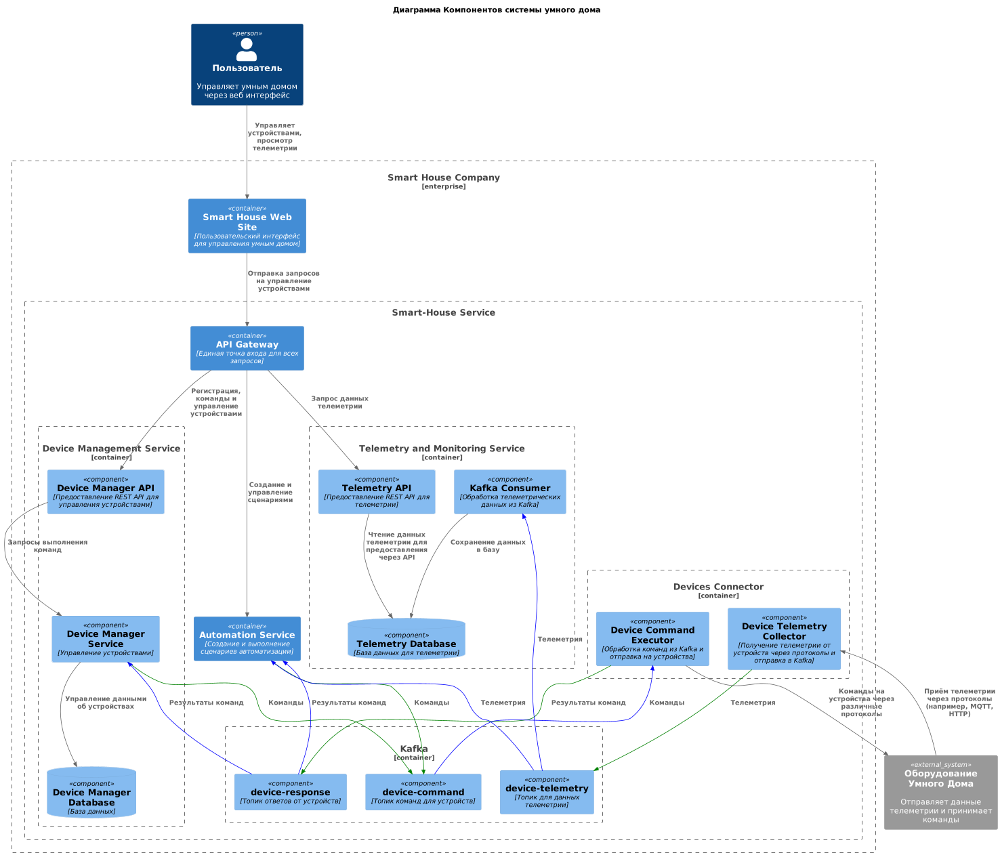

# 3 спринт

## Задание 1: Анализ и проектирование

### Подзадание 1.1: Анализ и планирование

> Изучите функциональность текущего монолитного приложения и поймёте, как оно работает

#### Описание функциональности текущего монолитного приложения.

- Мониторинг температуры:
    - Получение данных о температуре с датчиков, установленных в домах пользователей.
    - Возможность просмотра текущей температуры через веб-интерфейс.

> Проанализируете архитектуру монолитного приложения, выявите его сильные и слабые стороны

#### Анализ архитектуры монолитного приложения (язык программирования, база данных, архитектура, взаимодействие, масштабируемость, развертывание).

- Язык программирования: Приложение написано на Java.
- База данных: Используется реляционная база данных PostgreSQL.
- Архитектура: Монолитное приложение, в котором все компоненты (бизнес-логика, обработка запросов, взаимодействие с
  базой данных) находятся в одном коде.
- Взаимодействие: Синхронное, то есть запросы обрабатываются последовательно, и каждое действие требует ответа для
  продолжения.
- Масштабируемость: Ограничена, так как монолитные приложения сложно масштабировать по частям. В случае увеличения
  нагрузки требуется масштабировать весь монолит целиком.
- Развертывание: Требует остановки всего приложения при внесении изменений или обновления.

> Определите домены и границы контекстов в соответствии с принципами Domain-Driven Design (DDD)

#### Домены и границы контекстов в системе.

1. **Управление пользователями и домами (User and Home Management)**
    - Контекст "Управление пользователями":
        - Регистрация, авторизация, управление учётными записями, ролями и правами доступа.
    - Контекст "Управление домами":
        - Управление домами, правами доступа и привязка устройств к домам.

2. **Управление устройствами (Device Management)**
    - Контекст "Регистрация и управление устройствами":
        - Регистрация новых устройств, настройка, обновление прошивок, управление состоянием устройств.

3. **Мониторинг и телеметрия (Monitoring and Telemetry)**
    - Контекст "Управление телеметрией":
        - Сбор данных с устройств (push-телеметрия), хранение данных для анализа.
    - Контекст "Мониторинг оборудования":
        - Отслеживание состояния устройств и отправка уведомлений при сбоях (низкий заряд батареи, потеря связи).

4. **Автоматизация сценариев (Automation)**
    - Контекст "Создание и управление сценариями":
        - Создание сценариев автоматизации для управления устройствами на основе условий и событий.

5. **Взаимодействие с устройствами (Device Interaction)**
    - Контекст "Исполнение команд устройств (Device Command Execution)":
        - Отправка команд на устройства, получение результатов выполнения команд, публикация результатов в топик Kafka (
          `device-response`).
    - Контекст "Приём телеметрии (Device Telemetry Reception)":
        - Получение push-сообщений (телеметрии) от устройств через разные протоколы и отправка данных в топик Kafka (
          `device-telemetry`).

> Создадите C4 диаграмму (System Context diagram), визуализирующую взаимодействие монолитного приложения с внешним миром

#### Диаграмма C4 с использованием PlantUML.


Перед отправкой проверьте, что

- [x] Описана функциональность текущего монолитного приложения.
- [x] Проанализирована архитектура монолитного приложения (язык программирования, база данных, архитектура,
  взаимодействие, масштабируемость, развертывание).
- [x] Определены домены и границы контекстов в системе.
- [x] Создана C4 диаграмма (System Context diagram), визуализирующая взаимодействие монолитного приложения с внешним
  миром.
- [x] Диаграмма создана с использованием PlantUML и соответствует стандартам C4.

### Подзадание 1.2: Архитектура микросервисов

> Система разбита на микросервисы в соответствии с выделенными доменами и границами контекстов.

#### Разбивка на микросервисы в соответствии с выделенными доменами и границами контекстов.

1. **User and Home Management Service**
    - **Функции**:
        - Регистрация и авторизация пользователей.
        - Управление учётными записями, ролями и правами доступа.
        - Управление домами (создание, удаление, привязка устройств).

2. **Device Management Service**
    - **Функции**:
        - Регистрация новых устройств в системе.
        - Управление состоянием устройств (включение/выключение, обновление прошивки, настройка параметров).
    - **Взаимодействие**:
        - Публикация команд в топик Kafka `device-command`.
        - Подписка на топик `device-response` для отслеживания статуса выполнения команд.

3. **Device Command Executor (отдельный микросервис)**
    - **Функции**:
        - Получение команд из топика Kafka `device-command`.
        - Отправка команд на устройства через различные протоколы (MQTT, Zigbee, HTTP и др.).
        - Обработка ответа от устройств.
        - Публикация результата выполнения команды в топик `device-response`.

4. **Device Telemetry Collector (отдельный микросервис)**
    - **Функции**:
        - Получение push-сообщений (телеметрии) от устройств через различные протоколы (например, MQTT, HTTP).
        - Публикация данных телеметрии в топик Kafka `device-telemetry`.
    - **Взаимодействие**:
        - Публикация всех данных телеметрии в топик Kafka, чтобы их мог забрать **Telemetry and Monitoring Service**.

5. **Telemetry and Monitoring Service**
    - **Функции**:
        - Подписка на топик Kafka `device-telemetry`.
        - Хранение и обработка данных телеметрии для последующего анализа.
        - Мониторинг состояния устройств и отправка уведомлений при возникновении проблем (например, потеря связи,
          низкий заряд батареи).

6. **Automation Service**
    - **Функции**:
        - Создание, редактирование и управление автоматическими сценариями.
        - Подписка на топики `device-telemetry` и `device-response` для выполнения сценариев на основе событий (
          например, автоматическое включение света при срабатывании датчика движения).
        - Публикация команд в топик `device-command` в рамках выполнения сценариев.

> Определено взаимодействие между микросервисами, API Gateway, базой данных и, если используется, шиной данных (
> например, Kafka).

#### Взаимодействие между микросервисами

1. **API Gateway**
    - **Роль**: Центральная точка входа для всех внешних запросов от пользователей. Маршрутизирует запросы к нужным
      микросервисам и управляет аутентификацией и авторизацией.
    - **Взаимодействие**:
        - При запросах пользователей на управление устройствами или настройку сценариев отправляет запросы к **User and
          Home Management Service**, **Device Management Service**, и **Automation Service**.

2. **User and Home Management Service**
    - **Роль**: Управляет пользователями и домами.
    - **Взаимодействие**:
        - Получает запросы от **API Gateway** для регистрации пользователей, управления учётными записями, создания и
          управления домами.
        - Хранит данные пользователей и домов в собственной базе данных.

3. **Device Management Service**
    - **Роль**: Управляет регистрацией устройств и состоянием.
    - **Взаимодействие**:
        - Получает команды от **API Gateway** для управления устройствами (включение/выключение, настройка).
        - Публикует команды на устройства в топик Kafka `device-command`.
        - Подписывается на топик `device-response`, чтобы отслеживать результаты выполнения команд.
        - Хранит информацию об устройствах в собственной базе данных.

4. **Device Command Executor**
    - **Роль**: Отправляет команды на устройства и обрабатывает ответы.
    - **Взаимодействие**:
        - Подписывается на топик Kafka `device-command`, чтобы получить команды от **Device Management Service**.
        - Отправляет команды на устройства через различные протоколы (MQTT, Zigbee, HTTP и др.).
        - Публикует результаты выполнения команд в топик Kafka `device-response`.

5. **Device Telemetry Collector**
    - **Роль**: Получает телеметрию от устройств и публикует её для последующего анализа.
    - **Взаимодействие**:
        - Получает телеметрические данные через push-сообщения от устройств через различные протоколы.
        - Публикует данные телеметрии в топик Kafka `device-telemetry`.

6. **Telemetry and Monitoring Service**
    - **Роль**: Обрабатывает и хранит данные телеметрии, мониторит состояние устройств.
    - **Взаимодействие**:
        - Подписывается на топик Kafka `device-telemetry`, чтобы получать и хранить телеметрию от устройств.
        - Хранит данные телеметрии в собственной базе данных.
        - Отправляет уведомления в случае сбоев оборудования.

7. **Automation Service**
    - **Роль**: Управляет автоматическими сценариями на основе событий и условий.
    - **Взаимодействие**:
        - Получает запросы от **API Gateway** для создания сценариев автоматизации.
        - Подписывается на топики Kafka `device-telemetry` и `device-response` для выполнения сценариев в ответ на
          события.
        - Публикует команды на устройства в топик Kafka `device-command` при выполнении сценариев.

Асинхронное взаимодействие через Kafka:

- **Команды**:
    - **Device Management Service**
        - публикует команды в топик `device-command`.
        - подписываются на `device-response`, чтобы отслеживать выполнение команд.
    - **Device Command Executor**
        - подписывается на топик `device-command` и отправляет команды на устройства.
        - Результаты выполнения команд публикуются в топик `device-response`.
    - **Automation Service**
        - подписываются на `device-response`, чтобы отслеживать выполнение команд.

- **Телеметрия**:
    - **Device Telemetry Collector**
        - получает данные от устройств и публикует их в топик `device-telemetry`.
    - **Telemetry and Monitoring Service**
        - подписывается на `device-telemetry` и сохраняет данные для анализа и мониторинга.
    - **Automation Service**
        - подписывается на `device-telemetry` для выполнения автоматических сценариев на основе данных телеметрии.

База данных:
Каждый микросервис имеет свою собственную базу данных:

- **User and Home Management Service** хранит данные пользователей и домов.
- **Device Management Service** хранит данные устройств и их состояния.
- **Telemetry and Monitoring Service** хранит телеметрию для анализа и мониторинга.

> Созданы C4 диаграммы на уровне контейнеров (Containers) и компонентов (Components), визуализирующие архитектуру
> системы.
> При необходимости созданы C4 диаграммы на уровне кода (Code) для самых критичных частей системы.
> Все диаграммы созданы с использованием PlantUML и соответствуют стандартам C4.



Перед отправкой проверьте, что

- [X] Система разбита на микросервисы в соответствии с выделенными доменами и границами контекстов.
- [X] Определено взаимодействие между микросервисами, API Gateway, базой данных и, если используется, шиной данных (
  например, Kafka).
- [x] Созданы C4 диаграммы на уровне контейнеров (Containers) и компонентов (Components), визуализирующие архитектуру
  системы.
- [x] При необходимости созданы C4 диаграммы на уровне кода (Code) для самых критичных частей системы.
- [x] Все диаграммы созданы с использованием PlantUML и соответствуют стандартам C4.

### Подзадание 1.3: ER-диаграмма


Перед отправкой проверьте, что

- [x] Определены основные сущности системы, например как «Пользователь», «Дом», «Устройство», «Тип устройства», «Модуль»
  и «Телеметрия».
- [x] Для каждой сущности определены необходимые атрибуты.
- [x] Описаны связи между сущностями (один-к-одному, один-ко-многим, многие-ко-многим).
- [x] Создана ER-диаграмма с использованием PlantUML.
- [x] ER-диаграмма корректно отображает все сущности, их атрибуты и связи между ними.

### Подзадание 1.4: Создание и документирование API

> Выбраны типы API (REST, AsyncAPI или их комбинация) для взаимодействия между микросервисами «Управление
> устройствами» и «Телеметрия».

**Выбор типов API**

- **Device Management Service**:
    - **Тип API**: REST API, так как управление устройствами подразумевает синхронное взаимодействие (
      включение/выключение устройства, настройка параметров).

- **Telemetry and Monitoring Service**:
    - **Тип API**: **REST API** для запросов исторических данных телеметрии

> Спроектированы эндпойнты и методы запросов для основных операций микросервисов.

**Проектирование эндпойнтов и методов запросов для основных операций**

- **Device Management Service** (REST API)
    - **POST /devices**: Регистрация нового устройства.
    - **GET /devices**: Получение списка всех устройств.
    - **GET /devices/{device_id}**: Получение информации о конкретном устройстве.
    - **PUT /devices/{device_id}/state**: Управление состоянием устройства (включение/выключение).
    - **PUT /devices/{device_id}/config**: Обновление параметров устройства.
    - **DELETE /devices/{device_id}**: Удаление устройства.

- **Telemetry and Monitoring Service** (REST и AsyncAPI)
    - **GET /telemetry** (REST): Получение исторических данных телеметрии.
    - **GET /telemetry/{device_id}** (REST): Получение телеметрии для конкретного устройства.

> Описаны контракты взаимодействия для каждого эндпойнта, включая форматы запросов и ответов, коды ответа и примеры.
> Создана интерактивная документация API с использованием Swagger/OpenAPI (для REST API) или AsyncAPI.
> Документация API покрывает все эндпойнты и содержит исчерпывающую информацию для их использования.

[openAPI Docs](openapi.yaml)

Перед отправкой проверьте, что

- [x] Выбраны типы API (REST, AsyncAPI или их комбинация) для взаимодействия между микросервисами «Управление
  устройствами» и «Телеметрия».
- [x] Спроектированы эндпойнты и методы запросов для основных операций микросервисов.
- [x] Описаны контракты взаимодействия для каждого эндпойнта, включая форматы запросов и ответов, коды ответа и примеры.
- [x] Создана интерактивная документация API с использованием Swagger/OpenAPI (для REST API) или AsyncAPI.
- [x] Документация API покрывает все эндпойнты и содержит исчерпывающую информацию для их использования.


## Опциональные задания 

```
## Задание 2: Разработка MVP (опционально)
### Подзадание 2.1: Новые микросервисы и интеграция с монолитом
### Подзадание 2.2: Подготовка 3rd party сервисов для связи микросервисов
## Задание 3: Автоматизация поставки (опционально)
### Подзадание 3.1: Контейнеризация микросервисов
### Подзадание 3.2: Настройка CI/CD пайплайнов
```
не выполнялись